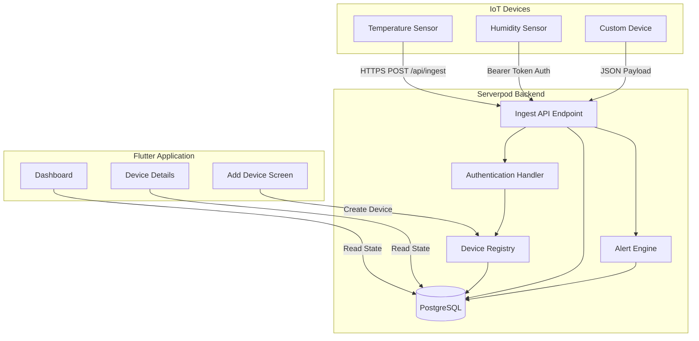

# Design Document

## Overview

The IoT Device Integration feature implements a secure, vendor-agnostic system for real IoT devices to send sensor data to the IoT Butler application. The design follows a strict architectural pattern where IoT devices communicate exclusively with the Serverpod backend through HTTPS, while the Flutter application reads all state from Serverpod. This ensures proper separation of concerns and maintains security boundaries.

The system uses explicit device registration with API-key based authentication, preventing unauthorized devices from injecting data while providing a simple integration path for any device or service capable of making HTTP requests.

## Architecture

### High-Level Architecture



### Data Flow

1. **Device Registration Flow**:
   - User creates device through Flutter app
   - Serverpod generates unique API key
   - Device record stored in PostgreSQL
   - API key returned to user for device configuration

2. **Data Ingest Flow**:
   - IoT device sends HTTPS POST to `/api/ingest`
   - Serverpod validates Bearer token authentication
   - Device lookup performed using API key + device ID
   - Sensor reading stored in database
   - Device status and lastSeen updated
   - Alert thresholds evaluated
   - Response returned to device

3. **Flutter Update Flow**:
   - Flutter reads updated device status from Serverpod
   - Dashboard reflects real-time device states
   - Charts update with new sensor readings
   - Alerts display when thresholds exceeded

## Components and Interfaces

### Device Registry Component

**Purpose**: Manages device registration and API key generation

**Interface**:
```dart
class DeviceRegistryService {
  Future<DeviceWithApiKey> createDevice({
    required String name,
    required String type,
    required String location,
  });
  
  Future<Device?> findDeviceByApiKey(String apiKey, String deviceId);
  Future<void> updateDeviceStatus(String deviceId, DeviceStatus status);
  Future<void> updateLastSeen(String deviceId, DateTime timestamp);
}
```

**Responsibilities**:
- Generate cryptographically secure API keys using `crypto` package
- Store device records with secure API key hashing
- Validate device existence during ingest operations
- Update device operational status and timestamps

### Ingest API Endpoint

**Purpose**: Secure HTTPS endpoint for IoT device data submission

**Interface**:
```dart
class IngestEndpoint extends Endpoint {
  @override
  bool get requireLogin => false; // Uses custom authentication
  
  Future<IngestResponse> ingest(
    Session session,
    IngestRequest request,
  );
}
```

**Request Model**:
```dart
class IngestRequest {
  String deviceId;
  String type; // temperature, voltage, humidity, custom
  double value;
}
```

**Response Model**:
```dart
class IngestResponse {
  String status; // "ok" or "error"
  bool alertTriggered;
  String? errorMessage;
}
```

**Responsibilities**:
- Validate Bearer token authentication
- Parse and validate JSON payload structure
- Authenticate device using API key
- Store sensor readings in database
- Update device operational status
- Trigger alert evaluation
- Return appropriate HTTP status codes

### Custom Authentication Handler

**Purpose**: Validates API key authentication for IoT devices

**Interface**:
```dart
Future<AuthenticationInfo?> iotDeviceAuthHandler(
  Session session,
  String token,
) async {
  // Validate Bearer token format
  // Lookup device by API key
  // Return AuthenticationInfo or null
}
```

**Implementation**:
- Extracts Bearer token from Authorization header
- Performs secure API key validation against database
- Returns device-specific AuthenticationInfo for authorized requests
- Returns null for invalid or missing authentication

### Alert Integration Component

**Purpose**: Integrates with existing alert system for threshold monitoring

**Interface**:
```dart
class AlertIntegrationService {
  Future<bool> evaluateThresholds(
    String deviceId,
    String sensorType,
    double value,
  );
  
  Future<void> triggerAlert(
    String deviceId,
    String alertType,
    Map<String, dynamic> alertData,
  );
}
```

**Responsibilities**:
- Evaluate sensor readings against configured thresholds
- Trigger alerts using existing alert engine
- Update device status to "warning" when thresholds exceeded
- Maintain compatibility with current alert logic

## Data Models

### Enhanced Device Model

```dart
class Device {
  int id;
  String name;
  String type; // existing types + "other"
  String location;
  String apiKeyHash; // Securely hashed API key
  DeviceStatus status; // offline, online, warning
  DateTime? lastSeen;
  DateTime createdAt;
  DateTime updatedAt;
}
```

### Device Creation Response Model

```dart
class DeviceWithApiKey {
  Device device;
  String apiKey; // Plain text API key (returned once)
}
```

### Sensor Reading Model

```dart
class SensorReading {
  int id;
  int deviceId;
  String type;
  double value;
  DateTime timestamp;
  bool alertTriggered;
}
```

### Ingest Request/Response Models

```dart
class IngestRequest {
  String deviceId;
  String type;
  double value;
}

class IngestResponse {
  String status;
  bool alertTriggered;
  String? errorMessage;
}
```

Now I need to use the prework tool to analyze the acceptance criteria before writing the correctness properties.
## Correctness Properties

*A property is a characteristic or behavior that should hold true across all valid executions of a system—essentially, a formal statement about what the system should do. Properties serve as the bridge between human-readable specifications and machine-verifiable correctness guarantees.*

### Property 1: Device Registration Completeness
*For any* valid device creation request (name, type, location), the Device Registry should create a device record containing all required fields (id, name, type, location, apiKeyHash, status=offline, lastSeen=null, timestamps) and return a unique API key.
**Validates: Requirements 1.1, 1.3, 1.4, 1.5**

### Property 2: API Key Cryptographic Security
*For any* generated API key, it should meet cryptographic security standards with sufficient entropy, randomness, and minimum length requirements (at least 32 characters).
**Validates: Requirements 1.2**

### Property 3: API Key Uniqueness
*For any* set of device creation operations, all generated API keys should be unique across the entire system.
**Validates: Requirements 1.1, 1.2**

### Property 4: Authentication Validation
*For any* ingest request, the system should accept requests with valid Bearer tokens from registered devices and reject requests with invalid, missing, or malformed authentication headers.
**Validates: Requirements 2.2, 2.4, 3.1**

### Property 5: JSON Payload Validation
*For any* ingest request payload, the system should accept well-formed JSON containing deviceId, type, and value fields, and reject malformed JSON or payloads missing required fields with HTTP 400 status.
**Validates: Requirements 2.3, 5.1**

### Property 6: Device Lookup Security
*For any* ingest request with valid authentication, the system should only process requests where the API key matches the deviceId of a registered device, rejecting mismatched combinations with HTTP 404 status.
**Validates: Requirements 3.1, 3.3, 5.3**

### Property 7: No Auto-Registration
*For any* ingest request with an unknown device, the system should reject the request rather than automatically creating a new device record.
**Validates: Requirements 3.4**

### Property 8: Sensor Data Persistence
*For any* successfully authenticated ingest request, the system should store the sensor reading in the database with correct deviceId, type, value, and timestamp.
**Validates: Requirements 2.5**

### Property 9: Device Status Management
*For any* successful sensor data ingest, the system should update the device status to online and update the lastSeen timestamp to the current time.
**Validates: Requirements 4.1, 4.2**

### Property 10: Alert-Triggered Status Updates
*For any* sensor reading that exceeds configured alert thresholds, the system should update the device status to warning and include alert information in the response.
**Validates: Requirements 4.3, 6.3**

### Property 11: Alert Threshold Evaluation
*For any* ingested sensor reading, the system should evaluate it against configured thresholds and trigger alerts when thresholds are exceeded.
**Validates: Requirements 6.1, 6.2**

### Property 12: HTTP Status Code Consistency
*For any* ingest request, the system should return appropriate HTTP status codes: 200 for success, 400 for malformed requests, 401 for authentication failures, 404 for device not found, and 500 for server errors.
**Validates: Requirements 5.1, 5.2, 5.3, 5.4, 5.5**

### Property 13: Authentication Failure Logging
*For any* failed authentication attempt, the system should log the failure with sufficient detail for security monitoring.
**Validates: Requirements 3.5**

### Property 14: Response Format Consistency
*For any* successful ingest request, the response should contain status="ok", alertTriggered boolean, and optional error message fields in valid JSON format.
**Validates: Requirements 5.5**

## Error Handling

### Authentication Errors
- **Invalid Bearer Token**: Return HTTP 401 with `{"status": "error", "errorMessage": "Invalid authentication"}`
- **Missing Authorization Header**: Return HTTP 401 with `{"status": "error", "errorMessage": "Missing authentication"}`
- **Malformed Bearer Token**: Return HTTP 401 with `{"status": "error", "errorMessage": "Invalid authentication format"}`

### Request Validation Errors
- **Malformed JSON**: Return HTTP 400 with `{"status": "error", "errorMessage": "Invalid JSON payload"}`
- **Missing Required Fields**: Return HTTP 400 with `{"status": "error", "errorMessage": "Missing required fields: [field_names]"}`
- **Invalid Field Types**: Return HTTP 400 with `{"status": "error", "errorMessage": "Invalid field type for [field_name]"}`

### Device Lookup Errors
- **Device Not Found**: Return HTTP 404 with `{"status": "error", "errorMessage": "Device not found"}`
- **API Key Mismatch**: Return HTTP 404 with `{"status": "error", "errorMessage": "Device not found"}`

### Server Errors
- **Database Connection Failure**: Return HTTP 500 with `{"status": "error", "errorMessage": "Internal server error"}`
- **Unexpected Exceptions**: Return HTTP 500 with `{"status": "error", "errorMessage": "Internal server error"}`

### Security Logging
All authentication failures and suspicious activities should be logged with:
- Timestamp
- Source IP address
- Attempted API key (hashed)
- Device ID attempted
- Failure reason
- Request headers (sanitized)

## Testing Strategy

### Dual Testing Approach
The IoT Device Integration feature requires both unit tests and property-based tests to ensure comprehensive coverage:

**Unit Tests** focus on:
- Specific examples of device registration flows
- Edge cases like empty device names or invalid types
- Integration points between components
- Error conditions and exception handling
- Specific alert threshold scenarios

**Property-Based Tests** focus on:
- Universal properties that hold across all inputs
- Comprehensive input coverage through randomization
- Security properties like API key uniqueness and authentication
- Data consistency across concurrent operations

### Property-Based Testing Configuration
- **Testing Framework**: Use `test` package with `fake` package for data generation
- **Minimum Iterations**: 100 iterations per property test
- **Test Tagging**: Each property test must reference its design document property
- **Tag Format**: `Feature: iot-device-integration, Property {number}: {property_text}`

### Test Categories

**Device Registration Tests**:
- Unit tests for specific device types and validation scenarios
- Property tests for API key generation and uniqueness
- Property tests for device record completeness

**Authentication Tests**:
- Unit tests for specific authentication failure scenarios
- Property tests for Bearer token validation across all possible inputs
- Property tests for API key security properties

**Data Ingest Tests**:
- Unit tests for specific sensor reading formats
- Property tests for JSON validation across all possible payloads
- Property tests for device lookup and authentication

**Alert Integration Tests**:
- Unit tests for specific threshold configurations
- Property tests for alert evaluation across all sensor values
- Property tests for status updates when alerts trigger

**Error Handling Tests**:
- Unit tests for specific error scenarios
- Property tests for HTTP status code consistency
- Property tests for error response format validation

### Integration Testing
- End-to-end tests demonstrating curl command examples
- Flutter integration tests showing real-time status updates
- Alert triggering demonstrations with threshold exceedance
- Multi-environment compatibility verification

The testing strategy ensures that both specific examples work correctly (unit tests) and that universal properties hold across all possible inputs (property tests), providing comprehensive validation of the IoT integration system.